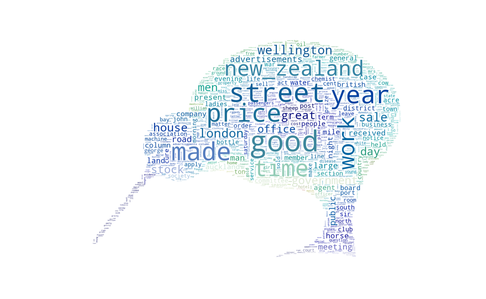

# Topic Modeling on Historical Newspapers of New Zealand
---
<br/>
#### A [UC](https://canterbury.ac.nz/) [MADS](https://www.canterbury.ac.nz/study/qualifications-and-courses/masters-degrees/master-of-applied-data-science/) [Data601 Project](https://www.canterbury.ac.nz/courseinfo/GetCourseDetails.aspx?course=DATA601&occurrence=18X(C)&year=2018)





## Background

[The National Library](https://natlib.govt.nz/) of New Zealand's job is to "collect, connect and co-create knowledge" for the benefit of Aotearoa New Zealand. As New Zealand's library of legal deposit, NLNZ collects publications and resources created in New Zealand, as well as metadata about these items. Increasingly, the National Library works with digital collections and datasets. DigitalNZ is part of the National Library of New Zealand, inside the Department of Internal Affairs, and works with institutions around New Zealand to make our country's digital cultural heritage collections visible. As they put it, "DigitalNZ is the search site for all things New Zealand. We connect you to reliable digital collections from our content partners - libraries, museums, galleries, government departments, the media, community groups and others."

[Papers Past](https://paperspast.natlib.govt.nz/) is a digitised collection of New Zealand's historical publications. Currently, the collection contains newspapers from 1839 to 1949. The newspaper articles have been digitised using Optical Character Recognition (OCR), but sometimes with poor quality results. DigitalNZ currently provides this digitised text in its search results for a substantial portion of the Papers Past collection, but would like to explore ways to provide more readable and useful metadata to its users. 


## Target

This project will explore different methods of using [LDA](http://www.jmlr.org/papers/volume3/blei03a/blei03a.pdf) topic modelling on the data with the goal of finding a good way of organising Papers Past by topic. It is anticipated that topic models may avoid the problems associated with low-quality OCR and offer better ways for users to explore the collection. 

We will use the [MALLET](http://mallet.cs.umass.edu/) implementation of the LDA algorithm to make recommendations about the best number of topics to include and strategies for improving the model, e.g., identifying 'bad OCR' topics to filter out of the training data set. We will visualise and report on the results over time and by region to give a descriptive overview of Papers Past through the topics. We will also make recommendations about the best ways to present topic model results to users, e.g., number of topics to show, inclusion or exclusion of bigrams.

The primary outcome will be a report documenting the methodology, analysis of results and recommendations for NLNZ. Any configuration files or pre-processing scripts should be included as appendices.


## Dataset

The Papers Past dataset contains:
* total 33 GB,
* total 68 files,
* total 16,731,578 documents,
* each file contains 112 to 3,007,465 documents.


## Built With

We used below tools or pacakges in purpose:
* [jupyterlab](https://github.com/jupyterlab)
* [mallet](http://mallet.cs.umass.edu/)
* [matplotlib](https://matplotlib.org/index.html)
* [pandas](https://pandas.pydata.org/)
* [seaborn](https://seaborn.pydata.org/)
* [sklearn](https://scikit-learn.org/stable/)
* [spark](https://spark.apache.org/docs/2.4.0/)
* [textblob](https://github.com/sloria/textblob)
* [wordcloud](https://github.com/amueller/word_cloud)


## Setup

To run the notebooks locally, you will need Python3 as well as the libraries recorded in the [requirement.txt](https://github.com/xandercai/papers-past-topic-modeling/blob/master/requirement.txt). We recommend managing Python and the libraries using `pip`.

To set it up, first install `pip`, then you can duplicate the environment for these notebooks by running (in the command line):

```console
pip install -r /path/to/requirements.txt
```

## Contents

Part | File | Comment
---|---|---
[1-loading](https://github.com/xandercai/papers-past-topic-modeling/tree/master/1-loading) | [1-load.ipynb](https://github.com/xandercai/papers-past-topic-modeling/blob/master/1-loading/1-load.ipynb) | Load and learn the raw dataset situation.
[2-wrangling](https://github.com/xandercai/papers-past-topic-modeling/tree/master/2-wrangling) | [1-wrangling.ipynb](https://github.com/xandercai/papers-past-topic-modeling/blob/master/2-wrangling/1-wrangling.ipynb) | Data clean and feature engineering.
[3-exploring](https://github.com/xandercai/papers-past-topic-modeling/tree/master/3-exploring) | [1-explore.ipynb](https://github.com/xandercai/papers-past-topic-modeling/blob/master/3-exploring/1-explore.ipynb) | Analyze and visualize the clean dataset.
[4-preprocessing](https://github.com/xandercai/papers-past-topic-modeling/tree/master/4-preprocessing) | [1-preprocess.ipynb](https://github.com/xandercai/papers-past-topic-modeling/blob/master/4-preprocessing/1-preprocess.ipynb) | Experiment and discussion about OCR,<br/>spelling correction and other NLP text preprocesses.
[5-modeling](https://github.com/xandercai/papers-past-topic-modeling/tree/master/5-modeling) | [1-datasets.ipynb](https://github.com/xandercai/papers-past-topic-modeling/blob/master/5-modeling/1-datasets.ipynb) | Split and extract sample set and subsets.
&nbsp; | [2-model.ipynb](https://github.com/xandercai/papers-past-topic-modeling/blob/master/5-modeling/2-model.ipynb) | Topic modeling process.
[6-analyzing](https://github.com/xandercai/papers-past-topic-modeling/tree/master/6-analyzing) | [1-prepare.ipynb](https://github.com/xandercai/papers-past-topic-modeling/blob/master/6-analyzing/1-prepare.ipynb) | Prepare dataframes for analysis and visualization.
&nbsp; | [2-analysis-train.ipynb](https://github.com/xandercai/papers-past-topic-modeling/blob/master/6-analyzing/2-analysis-train.ipynb) | Analyze and visualize train set,<br/>which could represent the full dataset.
&nbsp; | [3-analysis-wwi.ipynb](https://github.com/xandercai/papers-past-topic-modeling/blob/master/6-analyzing/3-analysis-wwi.ipynb) | Analyze and visualize dataset during WWI,<br/>which focus on the topics of different time range.
&nbsp; | [4-analysis-regions.ipynb](https://github.com/xandercai/papers-past-topic-modeling/blob/master/6-analyzing/4-analysis-regions.ipynb) | Analyze and visualize dataset from specific regions,<br/>which focus on the topics of different region.
&nbsp; | [5-analysis-ads.ipynb](https://github.com/xandercai/papers-past-topic-modeling/blob/master/6-analyzing/5-analysis-ads.ipynb) | Analyze and visualize dataset from specific label (advertisements),<br/>which focus on the topics of different label (advertisements or not).
[7-applying](https://github.com/xandercai/papers-past-topic-modeling/tree/master/7-applying) | [1-mining.ipynb](https://github.com/xandercai/papers-past-topic-modeling/blob/master/7-applying/1-mining.ipynb) | The application of data mining -<br/>using linear regression to explore the correlation of topics.
&nbsp; | [2-sentiment.ipynb](https://github.com/xandercai/papers-past-topic-modeling/blob/master/7-applying/2-sentiment.ipynb) | The application of sentiment analysis -<br/>using a sentiment analysis package to learn the historical sentiment.


## Directory

Below shows the project directory tree, check [tree.txt](https://github.com/xandercai/papers-past-topic-modeling/blob/master/tree.txt) for more detail.

```
papers-past-topic-modeling
├── 1-loading
├── 2-wrangling
├── 3-exploring
├── 4-preprocessing
├── 5-modeling
│   └── words
├── 6-analyzing
├── 7-applying
├── data
│   ├── dataset
│   │   ├── clean
│   │   └── sample
│   │       ├── meta
│   │       ├── subset
│   │       │   ├── ads
│   │       │   ├── regions
│   │       │   └── wwi
│   │       └── train
│   └── papers_past
├── models
│   ├── ads
│   ├── regions
│   ├── train
│   └── wwi
├── temp
└── utils
```


## Version

1.0.0


## Copyright

[](http://badges.mit-license.org)&nbsp;<a rel="license" href="http://creativecommons.org/licenses/by-nc/4.0/"></a><br/>See [license.md](https://github.com/xandercai/papers-past-topic-modeling/blob/master/license.md) for details.
